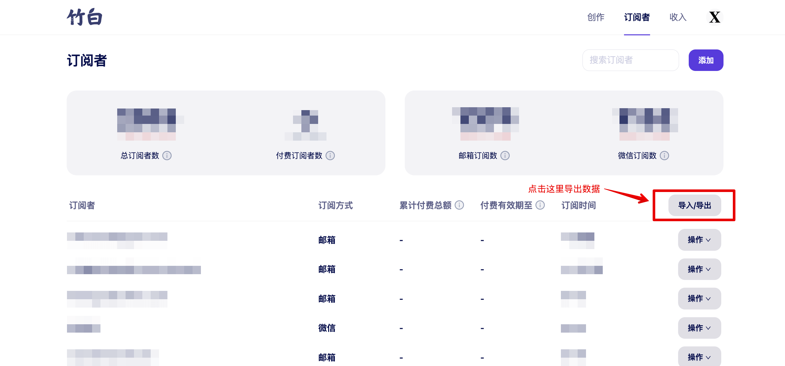
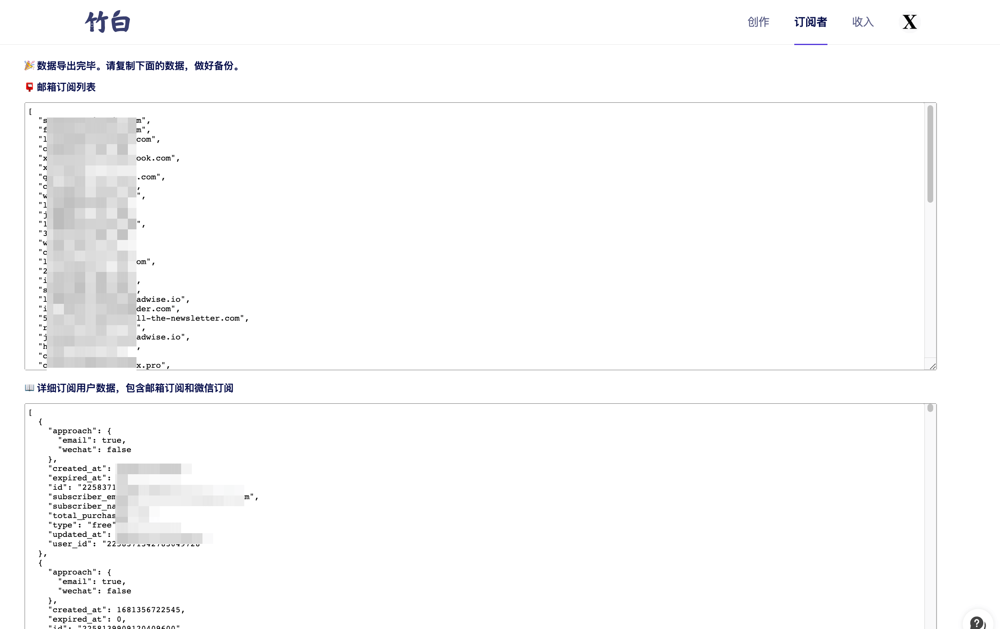

# 竹白工具箱 🧰

为竹白创作者的工具箱，包括订阅者信息导出，Markdown 编辑器等功能。更多功能欢迎交流。

欢迎订阅我的[《好工具周刊》](https://bestxtools.zhubai.love/)。

竹白没有官方的交流社区，大家有什么问题，欢迎来[这里](https://discuss-cn.pipecraft.net/t/zhubai)交流。




> 保存订阅者数据到文件里，定期（每周）备份。推荐使用 git 管理这些文件，可以看到数据变更记录。

> 如果文件上传到 GitHub/GitLab 等平台，因为涉及隐私数据，一定设置 repository 为 private。

## 功能

- ✅ 订阅者信息导出
- Markdown 编辑器

## Installation

- Chrome Extension: TBD
- Firefox Addon: TBD
- Userscript: [https://greasyfork.org/zh-CN/scripts/463934-zhubai-toolbox](https://greasyfork.org/zh-CN/scripts/463934-zhubai-toolbox)
- [Manual Installation](manual-installation.md)

## Development

This extension/userscript is built from [Browser Extension Starter and Userscript Starter](https://github.com/utags/browser-extension-starter)

## Features

- One codebase for Chrome extesions, Firefox addons, Userscripts, Bookmarklets and simple JavaScript modules
- Live-reload and React HMR
- [Plasmo](https://www.plasmo.com/) - The Browser Extension Framework
- [esbuild](https://esbuild.github.io/) - Bundler
- React
- TypeScript
- [Prettier](https://github.com/prettier/prettier) - Code Formatter
- [XO](https://github.com/xojs/xo) - JavaScript/TypeScript linter

## Showcases

- [UTags - Add usertags to links](https://github.com/utags/utags) - Allow users to add custom tags to links.
- [Hacker News Apps Switcher](https://github.com/dev-topics-only/hacker-news-apps-switcher) - Open Hacker News links on the favorite apps

## How To Make A New Extension

1. Fork [this starter repo](https://github.com/utags/browser-extension-starter), and rename repo to your extension name

2. Clone your repo

3. Install dependencies

```bash
pnpm install
# or
npm install
```

## Getting Started

First, run the development server:

```bash
pnpm dev
# or
npm run dev
```

Open your browser and load the appropriate development build. For example, if you are developing for the chrome browser, using manifest v3, use: `build/chrome-mv3-dev`.

You can start editing the popup by modifying `popup.tsx`. It should auto-update as you make changes. To add an options page, simply add a `options.tsx` file to the root of the project, with a react component default exported. Likewise to add a content page, add a `content.ts` file to the root of the project, importing some module and do some logic, then reload the extension on your browser.

For further guidance, [visit our Documentation](https://docs.plasmo.com/)

## Making production build

Run the following:

```bash
pnpm build
# or
npm run build
```

This should create a production bundle for your extension, ready to be zipped and published to the stores.

## Submit to the webstores

The easiest way to deploy your Plasmo extension is to use the built-in [bpp](https://bpp.browser.market) GitHub action. Prior to using this action however, make sure to build your extension and upload the first version to the store to establish the basic credentials. Then, simply follow [this setup instruction](https://docs.plasmo.com/framework/workflows/submit) and you should be on your way for automated submission!

## License

Copyright (c) 2023 [Pipecraft](https://www.pipecraft.net). Licensed under the [MIT License](LICENSE).

## >\_

[](https://www.pipecraft.net)
[](https://utags.pipecraft.net)
[](https://dto.pipecraft.net)
[](https://www.bestxtools.com)
